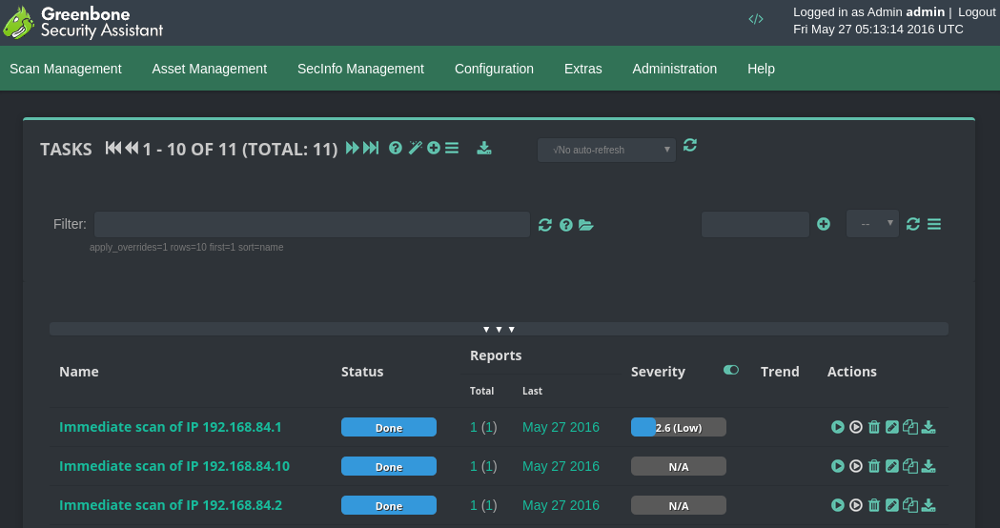
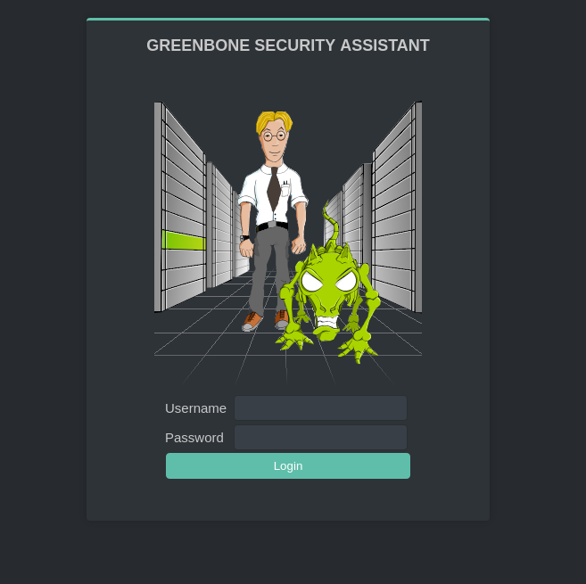
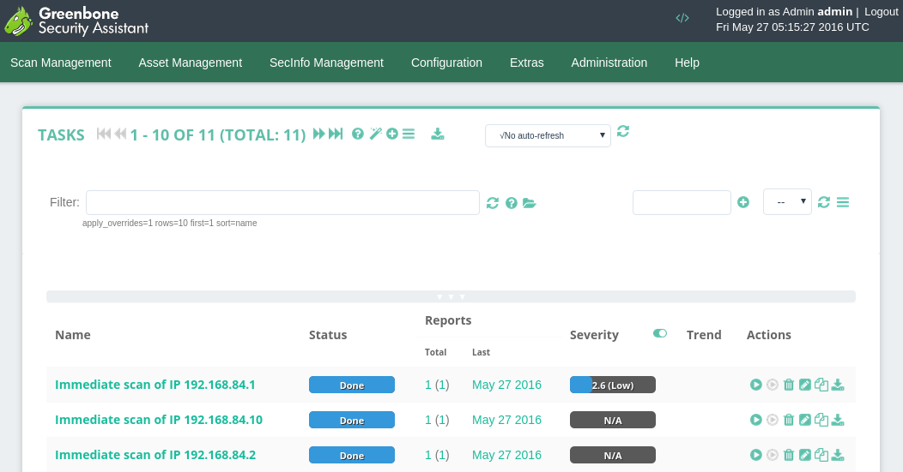
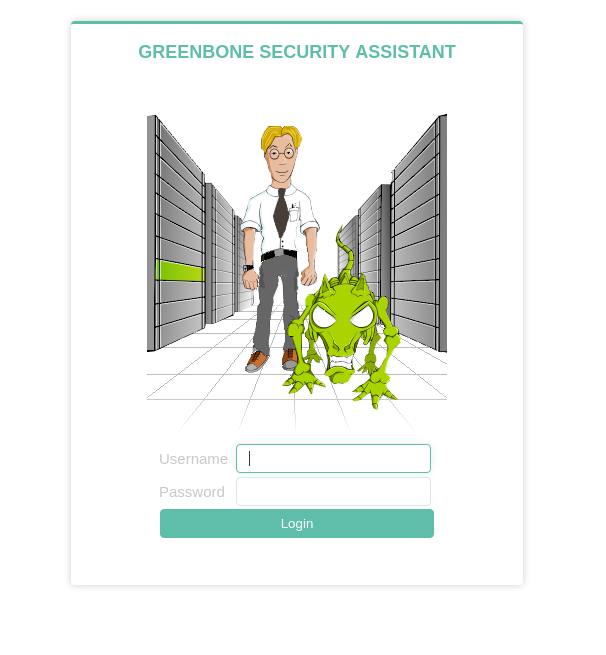

# Domarques OpenVAS GSA Theme

Customization of "**classic**" Greenbone Security Assistant (OpenVAS) theme. Some adjustments on styles, icons, fonts and interface width (fluid).

A single-day work, so, please, don't expect a perfect custom theme. I've checked most of pages and they are fine.

I intentionally didn't touched any markup file (`.xsl`, `.xml` etc.), only `.css` and `images`, just to ensure a better compatibility with newer releases.

## Compatibility

The theme was made using Greenbone Security Assistant (GSA) version **6.0.10**. I can't determine, right now, if is compatible with previous versions.

Just checked on latest version of Chrome and Firefox.

Didn't planned to turn theme compatible with mobile devices, because, for me, it doesn't make sense.

## Installation

Default GSA directory:

```bash
/usr/local/share/openvas/gsa
```

Download (`git` or `zip`) and upload files:

```bash
git clone https://github.com/domarques/gsa-domarques-theme.git
scp -r gsa-domarques-theme root@ip_or_fqdn:/usr/local/share/openvas/gsa
```

Since GSA don't have an option to change theme on web interface, just replace folders:

```bash
ssh root@ip_or_fqdn
cd /usr/local/share/openvas/gsa
mv classic classic-orig
mv gsa-domarques-theme classic
```

Now, restart GSA:

```bash
killall gsad && gsad
```

## Customizing colors

This theme comes with 2 color schemes: **Dark** (_default_) and **Light**. See screenshots bellow.

Just switch style files:

```bash
mv gsa-style.css gsa-style-dark.css && mv gsa-style-light.css gsa-style.css
mv gsa-login.css gsa-login-dark.css && mv gsa-login-light.css gsa-login.css
```

## Screenshots

### Dark (_default_)





### Light





## Resources

* OpenVAS - http://www.openvas.org/
* Greenbone  - http://www.greenbone.net/
* Icons from Font Awesome - http://fontawesome.io/
* Font 'Open Sans' from Google - https://www.google.com/fonts/specimen/Open+Sans

## Original authors

 * Matthew Mundell
 * Karl-Heinz Ruskowski
 * Jan-Oliver Wagner
 * Timo Pollmeier

GSA Classic theme css styles.

## Legal

Copyright, attribution etc. remains to their respective owners. I only made a simple customization on the original theme.

